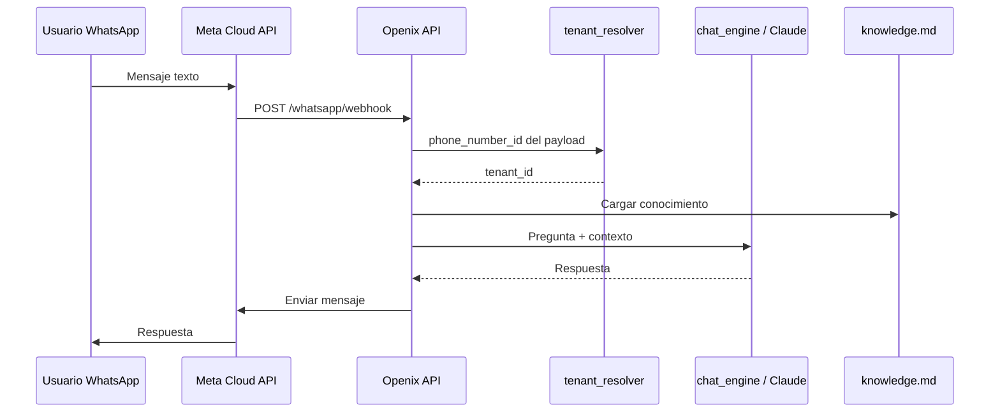

# Estrategia operativa y técnica — Chatbot Openix (agencia multi-cliente)

**Versión:** 1.0  
**Fecha:** mayo 2026  
**Ámbito:** producto *Automatización Chatbot* dentro del monorepo *Agencia de automatizaciones*  
**Objetivo:** preparar Openix para operar **hasta ~50 clientes** con riesgo controlado, proceso repetible y arquitectura **mix** (API propia + Make para operaciones).

---

## 1. Resumen ejecutivo

Openix vende chatbots conversacionales a empresas: suben documentos (Markdown, texto, PDF), publican el bot y los usuarios preguntan por **web** o **WhatsApp**. La IA (Claude) responde **solo** con lo que hay en el conocimiento del cliente; no inventa datos.

**Acuerdos de arquitectura:**

| Decisión | Detalle |
|----------|---------|
| Modelo de negocio | **Agencia**: Openix gestiona muchos clientes; no es un panel “personal” de una sola empresa. |
| Núcleo del producto | **API FastAPI** + almacén por cliente (`tenant`) + panel interno Openix. |
| WhatsApp en tiempo real | **Siempre en la API** (webhook Meta → resolver cliente → IA → respuesta). **Make no va en medio** del mensaje. |
| Make.com | **Capa periférica** para onboarding, CRM, Drive, alertas — cuando haya 5+ clientes y proceso repetido. |
| Escala 50 clientes | Misma app Meta + **un Phone number ID por cliente**; carpetas y `meta.json` por tenant; Make + checklist para no hacer 50 configuraciones a mano. |

---

## 2. Contexto en el monorepo

Productos **separados** (no mezclar documentación ni puertos):

| Carpeta | Producto | Puerto / nota |
|---------|----------|----------------|
| `Automatizacion Chatbot/` | Chatbot conversacional (este documento) | **8000** |
| `Automatizacion Facturas/` | FacturAI | 8010 |
| `Automatizacion Email Comercial/` | Borradores email B2B | 8020 |
| `Presupuesto Whatsapp/` | Menú numerado + LISTO + IVA | Motor hermano; `POST /presupuesto/simular` en el backend chatbot |
| `Pagina web/` | Sitio Openix + portal facturación | Independiente |

---

## 3. Visión: agencia con 50 clientes

### 3.1 Qué significa “50 clientes”

- **50 empresas** con su propio conocimiento, publicación y (idealmente) su número WhatsApp Business.
- **Un equipo Openix** que da de alta, sube documentos, conecta Meta y da soporte — sin reescribir código por cliente.
- **Un servidor** (o pocos entornos: staging + producción) con datos aislados por `tenant_id`.

### 3.2 Qué NO implica

- 50 aplicaciones Meta distintas (salvo clientes enterprise excepcionales).
- 50 despliegues del backend.
- Pasar cada mensaje de WhatsApp por Make.

### 3.3 Métricas de éxito operativas

| Métrica | Objetivo orientativo |
|---------|----------------------|
| Alta de cliente (sin docs) | &lt; 15 min (panel o Make) |
| Cliente listo en WhatsApp | &lt; 45 min (con docs y Meta ya preparados) |
| Tiempo de respuesta WhatsApp | &lt; 5 s (API directa, sin Make en el camino) |
| Incidencias por cambio Meta | Corregir en **1–3 archivos** Python del módulo WhatsApp |

---

## 4. Arquitectura acordada (mix)

### 4.1 Diagrama general

```text
┌─────────────────────────────────────────────────────────────────────────┐
│                         OPENIX (una vez en .env)                         │
│  ANTHROPIC_API_KEY · META_ACCESS_TOKEN · META_VERIFY_TOKEN · APP_SECRET │
└─────────────────────────────────────────────────────────────────────────┘
                                      │
        ┌─────────────────────────────┼─────────────────────────────┐
        │                             │                             │
        ▼                             ▼                             ▼
┌───────────────┐            ┌─────────────────┐            ┌──────────────┐
│  Panel Openix │            │  API FastAPI     │            │  Make.com     │
│  (equipo)     │◄──────────►│  Puerto 8000     │◄──────────►│  (operaciones)│
│  /panel/      │            │                  │   HTTP     │               │
└───────────────┘            └────────┬─────────┘            └──────────────┘
                                      │
                    ┌─────────────────┼─────────────────┐
                    │                 │                 │
                    ▼                 ▼                 ▼
            data/tenants/      Claude API        Meta WhatsApp
            {cliente}/         (Anthropic)       Cloud API
```

### 4.2 Camino crítico: mensaje WhatsApp (NO Make)

```text
Usuario WhatsApp
      │
      ▼
Meta Cloud API (webhook)
      │
      ▼
POST /whatsapp/webhook          ← único receptor del webhook
      │
      ├── Verificar firma (META_APP_SECRET) si está configurado
      ├── tenant_resolver: phone_number_id → tenant_id
      ├── chat_engine: knowledge.md + historial + Claude
      └── whatsapp_bot: enviar respuesta al usuario
```

**Regla de oro:** Make **nunca** está entre Meta y la respuesta al usuario.

### 4.3 Camino operativo: Make (después o en paralelo)

```text
Airtable / Formulario / CRM
      │
      ▼
Make: escenario "Nuevo cliente"
      │
      ▼
POST /bot/tenants  →  crear carpeta + meta.json + knowledge.md plantilla

Google Drive (carpeta cliente)
      │
      ▼
Make: "Nuevo archivo"
      │
      ▼
POST /bot/tenants/{id}/documentos  →  ampliar knowledge.md

Panel: Publicar chatbot
      │
      ▼
Make (opcional): webhook / evento → Slack + fila CRM "Activo"
```

### 4.4 Por qué este mix minimiza riesgos

| Riesgo | Mitigación |
|--------|------------|
| Meta cambia API de WhatsApp | Actualizar solo `routes_whatsapp.py`, `whatsapp_bot.py`, `tenant_resolver.py` |
| Cambio en CRM / Sheets / Slack | Ajustar escenarios Make; el chat sigue funcionando |
| Caída de Make | El bot responde; solo fallan avisos/altas automáticas |
| Caída del servidor Openix | Nada sustituye el núcleo; monitoring + backups de `data/` |
| Confusión de cliente en WhatsApp | `meta_phone_number_id` en `meta.json` + resolver por payload |

---

## 5. Modelo multi-cliente (tenant)

### 5.1 Identificador de cliente

- **`tenant_id`**: slug interno (`clinica-norte`, `taller-garcia`). Sin espacios; solo letras, números, `_` y `-`.
- **`nombre`**: nombre visible del negocio.
- **`meta_phone_number_id`**: ID del número en Meta para ese cliente (obligatorio para routing automático en producción).

### 5.2 Almacenamiento en disco

```text
chatbot-backend/data/tenants/{tenant_id}/
├── meta.json           # nombre, contacto, phone_number_id, publicado_at, fechas
├── knowledge.md        # texto que lee la IA (compilado de subidas)
├── uploads/            # archivos originales (.md, .txt, .pdf)
└── historial.json      # última Q/A (reformular "no entiendo")
```

### 5.3 Resolución de cliente en WhatsApp

Orden en `tenant_resolver.resolver_tenant_whatsapp()`:

1. `phone_number_id` del payload Meta → buscar en `meta.json` de todos los tenants.
2. Si coincide con `META_PHONE_NUMBER_ID` del `.env` → `CHATBOT_TENANT_DEFAULT`.
3. Si no → `CHATBOT_TENANT_DEFAULT` del `.env`.
4. Si no → primer cliente con `publicado_at`.
5. Si no hay ninguno → `default`.

**Recomendación a 50 clientes:** cada cliente con su `meta_phone_number_id` guardado; dejar `CHATBOT_TENANT_DEFAULT` solo para pruebas o un cliente fallback.

### 5.4 Meta: una app Openix, muchos números

- **Una** aplicación en [Meta for Developers](https://developers.facebook.com/) para Openix.
- **Un** `META_ACCESS_TOKEN` (token de sistema o larga duración según modelo elegido).
- **Un** webhook apuntando a `https://TU-DOMINIO/whatsapp/webhook`.
- **Por cliente:** número WhatsApp Business + su **Phone number ID** en la ficha del panel (`whatsapp.html`) o en `meta.json`.

---

## 6. Componentes actuales (implementado)

### 6.1 Backend (`chatbot-backend/`)

| Módulo | Función |
|--------|---------|
| `app/services/knowledge_store.py` | CRUD tenants, subidas, publicar, `crear_cliente`, `actualizar_meta_cliente` |
| `app/services/chat_engine.py` | Claude + `knowledge.md`; reformular si “no entiendo” |
| `app/services/tenant_resolver.py` | `tenant_id` desde webhook Meta |
| `app/services/whatsapp_bot.py` | Envío mensajes Meta |
| `app/api/routes_bot.py` | API REST clientes y conocimiento |
| `app/api/routes_whatsapp.py` | Webhook GET/POST Meta |
| `app/api/routes_setup.py` | Estado instalación por cliente |
| `app/api/routes_web.py` | Chat web / widget |
| `app/api/routes_presupuesto.py` | Simulador presupuesto (producto hermano) |

### 6.2 Panel (`panel/`)

| Página | Uso |
|--------|-----|
| `index.html` | Hub agencia Openix |
| `clientes.html` | Alta y listado de clientes |
| `configurar.html` | Documentos + publicar (`?cliente=id`) |
| `whatsapp.html` | Phone number ID por cliente |
| `probar.html` | Simular chat |
| `instalacion.html` | Guía única Openix (.env global) |
| `cliente-utils.js` | Cliente activo en sesión / query string |

**URL base:** `http://127.0.0.1:8000/panel/` (desarrollo) o `https://dominio/panel/` (producción).

### 6.3 Arranque

```bash
cd "Automatizacion Chatbot/chatbot-backend"
python3 -m venv .venv && source .venv/bin/activate
pip install -r requirements.txt
cp .env.example .env
# Editar .env
uvicorn app.main:app --reload --host 127.0.0.1 --port 8000
```

O doble clic en `start-chatbot.command` (macOS).

---

## 7. Variables de entorno (Openix — global)

Archivo: `chatbot-backend/.env`

| Variable | Quién | Descripción |
|----------|-------|-------------|
| `ANTHROPIC_API_KEY` | Openix | Clave IA; obligatoria para respuestas con sentido |
| `ANTHROPIC_MODEL` | Openix | Modelo Claude (ej. `claude-3-5-sonnet-latest`) |
| `META_ACCESS_TOKEN` | Openix | Token API WhatsApp (todos los números de la app) |
| `META_VERIFY_TOKEN` | Openix | Token que introduces en Meta al verificar webhook |
| `META_APP_SECRET` | Openix | Recomendado; valida firma `X-Hub-Signature-256` |
| `META_PHONE_NUMBER_ID` | Openix / pruebas | Fallback si un mensaje no mapea a un tenant |
| `CHATBOT_TENANT_DEFAULT` | Openix / pruebas | Tenant por defecto si no hay match por phone id |

**Por cliente (no van en `.env`):** `meta_phone_number_id`, documentos, `publicado_at` → en `data/tenants/{id}/meta.json` y panel.

---

## 8. API REST — referencia para panel y Make

Base: `https://TU-DOMINIO` (o `http://127.0.0.1:8000` en local).  
Documentación interactiva: `/docs`

### 8.1 Clientes (tenants)

| Método | Ruta | Descripción |
|--------|------|-------------|
| `GET` | `/bot/tenants` | Listar clientes (`clientes` / `tenants`) |
| `POST` | `/bot/tenants` | Crear cliente |
| `GET` | `/bot/tenants/{tenant_id}` | Detalle + `knowledge_markdown` |
| `PATCH` | `/bot/tenants/{tenant_id}` | Actualizar nombre, contacto, `meta_phone_number_id`, notas |
| `PUT` | `/bot/tenants/{tenant_id}/knowledge` | Guardar texto markdown |
| `POST` | `/bot/tenants/{tenant_id}/documentos` | Subir archivo (`multipart/form-data`, campo `archivo`) |
| `POST` | `/bot/tenants/{tenant_id}/publicar` | Marcar publicado (requiere conocimiento) |
| `POST` | `/bot/tenants/{tenant_id}/chat` | Probar conversación |

**Ejemplo crear cliente (Make o curl):**

```json
POST /bot/tenants
Content-Type: application/json

{
  "tenant_id": "clinica-norte",
  "nombre": "Clínica Norte",
  "contacto": "admin@clinicanorte.com",
  "meta_phone_number_id": ""
}
```

**Ejemplo actualizar Phone number ID:**

```json
PATCH /bot/tenants/clinica-norte
Content-Type: application/json

{
  "meta_phone_number_id": "123456789012345"
}
```

### 8.2 Estado e instalación

| Método | Ruta | Descripción |
|--------|------|-------------|
| `GET` | `/bot/setup/status?tenant_id=clinica-norte` | Pasos: IA, docs, publicado, WhatsApp |

### 8.3 WhatsApp

| Método | Ruta | Descripción |
|--------|------|-------------|
| `GET` | `/whatsapp/webhook` | Verificación Meta (`hub.verify_token`, etc.) |
| `POST` | `/whatsapp/webhook` | Mensajes entrantes Meta |
| `GET` | `/whatsapp/health` | Salud módulo WhatsApp |

### 8.4 Web y sistema

| Método | Ruta | Descripción |
|--------|------|-------------|
| `POST` | `/web/chat` | Chat widget (mismo motor, otro canal) |
| `GET` | `/health` | Salud API + ruta panel |

---

## 9. Flujos operativos detallados

### 9.1 Flujo A — Instalación única Openix (una vez)

1. Clonar repo y configurar `chatbot-backend/.env`.
2. Obtener `ANTHROPIC_API_KEY`.
3. Crear app Meta → WhatsApp → configurar **un** webhook:
   - URL: `https://DOMINIO/whatsapp/webhook`
   - Verify token = `META_VERIFY_TOKEN`
   - Suscribir campo **messages**
4. Desplegar API con HTTPS (no depender de ngrok en producción).
5. Verificar `GET /health` y panel `/panel/instalacion.html`.

### 9.2 Flujo B — Alta de un cliente nuevo (panel manual)

1. Panel → **Clientes** → crear `tenant_id` + nombre (+ contacto opcional).
2. **Documentos** (`configurar.html?cliente=...`):
   - Pegar markdown o subir `.md` / `.txt` / `.pdf`
   - **Guardar** → **Publicar chatbot**
3. **WhatsApp** (`whatsapp.html?cliente=...`):
   - Registrar número del cliente en Meta (o usar número ya vinculado a la app Openix)
   - Copiar **Phone number ID** → guardar en ficha
4. **Probar** (`probar.html`) — mínimo 5 preguntas reales del negocio.
5. Prueba desde móvil al número WhatsApp del cliente.

### 9.3 Flujo C — Alta automatizada con Make (fase 2+)

**Trigger:** nueva fila en Airtable (estado = "Contratado") o Typeform.

**Módulos Make (orden sugerido):**

1. **Trigger** — Airtable / Webhook
2. **HTTP — POST** `https://DOMINIO/bot/tenants`
   - Body: `tenant_id`, `nombre`, `contacto`, `meta_phone_number_id` (vacío si aún no hay número)
3. **Slack / Email** — "Cliente {nombre} creado; pendiente documentos"
4. *(Opcional)* **Google Drive** — crear carpeta `Clientes/{tenant_id}`
5. *(Opcional)* **Airtable** — actualizar fila con `tenant_id` y enlace panel `.../configurar.html?cliente=...`

**Importante:** la subida de PDFs y la publicación pueden seguir siendo humanas al principio; Make solo elimina el copy-paste del alta.

### 9.4 Flujo D — Sincronizar documento desde Drive (Make, fase 2+)

1. Trigger: nuevo archivo en carpeta `Clientes/{tenant_id}/`
2. Descargar archivo
3. `POST /bot/tenants/{tenant_id}/documentos` (multipart)
4. *(Opcional)* Notificar en Slack: "Docs actualizados para {tenant_id} — revisar y publicar"

**La publicación** (`POST .../publicar`) puede quedar manual hasta confiar en la calidad del contenido.

### 9.5 Flujo E — Cliente publicado (Make, fase 3)

**Opción 1 — Manual:** tras publicar en panel, ejecutar checklist.  
**Opción 2 — API futura:** `POST /webhooks/eventos` con `{ "evento": "publicado", "tenant_id": "..." }` → Make actualiza CRM.

Por ahora: trigger Make con **botón** o **watch Airtable** campo "Publicado = sí" actualizado por el equipo.

---

## 10. Plan por fases (cómo lo vamos a hacer)

### Fase 1 — Piloto (1–3 clientes) — **AHORA**

**Objetivo:** un cliente real en producción de punta a punta.

| # | Tarea | Responsable | Hecho |
|---|--------|-------------|-------|
| 1 | `.env` producción con Anthropic + Meta | Openix | ☐ |
| 2 | HTTPS + webhook Meta apuntando a producción | Openix | ☐ |
| 3 | Crear tenant piloto en panel Clientes | Openix | ☐ |
| 4 | Subir docs reales + Publicar | Openix + cliente | ☐ |
| 5 | Guardar Phone number ID del piloto | Openix | ☐ |
| 6 | 5 preguntas de prueba en panel + WhatsApp real | Openix | ☐ |
| 7 | Documentar incidencias y tiempos (plantilla abajo) | Openix | ☐ |

**No iniciar Make** hasta que el flujo B funcione dos veces seguidas sin errores.

---

### Fase 2 — Escala inicial (5–15 clientes)

**Objetivo:** onboarding repetible en &lt; 30 min.

| # | Tarea | Tipo |
|---|--------|------|
| 1 | Checklist impreso/Notion "Cliente nuevo" (sección 12) | Proceso |
| 2 | Escenario Make **solo** "Nuevo cliente → POST /bot/tenants" | Make |
| 3 | Añadir `MAKE_WEBHOOK_SECRET` o `X-Openix-Key` en API para llamadas Make | Código |
| 4 | Carpeta Drive estándar por `tenant_id` | Proceso |
| 5 | Backup diario de `data/tenants/` | Infra |
| 6 | Cliente `demo-openix` para pruebas sin tocar producción | Operación |

---

### Fase 3 — Escala agencia (15–50 clientes)

**Objetivo:** operar sin ahogar al equipo.

| # | Tarea | Tipo |
|---|--------|------|
| 1 | Login en panel (solo equipo Openix) | Código |
| 2 | Logs estructurados con `tenant_id` en cada mensaje WA | Código |
| 3 | Índice `phone_number_id → tenant_id` en memoria al arrancar (optimización) | Código |
| 4 | Make: sync Drive → documentos + alerta publicación | Make |
| 5 | Tabla facturación: cliente / plan / mensajes estimados | Operación |
| 6 | Revisión trimestral de `knowledge.md` por cliente | Operación |
| 7 | Monitor uptime (`/health`) + alertas | Infra |

---

## 11. Checklist — Cliente nuevo (~30–45 min)

### A. Comercial / CRM
- [ ] Contrato firmado y pago acordado
- [ ] Fila en Airtable/CRM con nombre, email, sector
- [ ] `tenant_id` acordado (slug único)

### B. Alta técnica
- [ ] Crear cliente (panel **Clientes** o Make `POST /bot/tenants`)
- [ ] Número WhatsApp del cliente vinculado a app Meta Openix (si aplica)
- [ ] Anotar **Phone number ID** en `whatsapp.html`

### C. Conocimiento
- [ ] Recibir PDF/MD del cliente (Drive o email)
- [ ] Subir en **Documentos** o pegar markdown
- [ ] Revisar tono, precios, horarios, exclusiones
- [ ] **Publicar chatbot**

### D. Pruebas
- [ ] 5 preguntas en `probar.html` con respuestas correctas
- [ ] Probar "no entiendo" → reformulación
- [ ] Mensaje real desde WhatsApp al número del cliente
- [ ] `GET /bot/setup/status?tenant_id=...` → listo para WhatsApp

### E. Entrega
- [ ] Email al cliente: número WhatsApp activo + qué puede preguntar
- [ ] CRM estado = "Activo"
- [ ] Fecha revisión documentos (+90 días)

---

## 12. Seguridad y cumplimiento (roadmap)

| Elemento | Estado actual | Objetivo 50 clientes |
|----------|---------------|----------------------|
| Panel sin auth | Abierto si API es pública | Login básico (usuario/contraseña Openix) |
| API sin token en `/bot/*` | Cualquiera con URL puede llamar | Header `X-Openix-Key` para Make y panel |
| Firma webhook Meta | Implementado si `META_APP_SECRET` | Obligatorio en producción |
| Datos clientes en disco | `data/tenants/` | Backup cifrado; no commitear `.env` ni `data/` |
| RGPD | — | DPA con clientes; política retención `historial.json` |

---

## 13. Costes y límites (orientativo)

| Concepto | Notas |
|----------|--------|
| **Anthropic** | Variable por mensajes × clientes; definir planes con tope mensual |
| **Meta WhatsApp** | Conversaciones según tarifas Meta por categoría |
| **Make** | Operaciones/mes según escenarios (no incluir chat) |
| **Servidor** | VPS 2–4 GB RAM suele bastar hasta mediana escala; escalar según CPU |
| **Dominio + SSL** | Obligatorio para webhook producción |

---

## 14. Qué NO hacer (acuerdos explícitos)

1. **No** poner Make entre Meta y la respuesta al usuario.
2. **No** usar un solo `mi-empresa` para todos los clientes en producción.
3. **No** commitear `.env` ni carpetas `data/tenants/` con datos reales.
4. **No** mezclar FacturAI ni Presupuesto WhatsApp en la misma documentación operativa del chatbot.
5. **No** prometer al cliente panel propio hasta tener auth y multi-tenant UI (fase 3+); de momento panel es **interno Openix**.

---

## 15. Evolución técnica pendiente (backlog acordado)

| Prioridad | Item | Descripción |
|-----------|------|-------------|
| P1 | Piloto en producción | 1 cliente real end-to-end |
| P2 | `X-Openix-Key` en rutas `/bot/*` | Proteger altas desde Make |
| P2 | Escenario Make "Nuevo cliente" | Documentado en Make + este doc |
| P3 | Auth panel | Sesión equipo Openix |
| P3 | `POST /webhooks/eventos` | Eventos `publicado`, `error` para Make |
| P3 | Índice phone_id → tenant | Optimizar resolver a 50+ tenants |
| P4 | Portal cliente (solo lectura) | Opcional: ver estado, no editar |

---

## 16. Resolución de problemas

| Síntoma | Causa probable | Acción |
|---------|----------------|--------|
| Bot no responde con sentido | Sin `ANTHROPIC_API_KEY` o knowledge vacío | `.env` + subir docs + publicar |
| WhatsApp no contesta | Webhook mal configurado o sin HTTPS | Meta → Configuration → webhook |
| Responde con datos de otro cliente | `meta_phone_number_id` incorrecto o default | Revisar ficha WhatsApp del cliente |
| PDF no se importa | Falta `pypdf` | `pip install pypdf` en venv |
| Panel no carga | API parada | `uvicorn` puerto 8000 |
| Make falla al crear cliente | URL, JSON o tenant duplicado | Ver respuesta HTTP en historial Make |

---

## 17. Diagrama Mermaid — secuencia mensaje WhatsApp



---

## 18. Enlaces útiles

| Recurso | URL |
|---------|-----|
| Panel local | http://127.0.0.1:8000/panel/ |
| API docs | http://127.0.0.1:8000/docs |
| Meta Developers | https://developers.facebook.com/ |
| Anthropic Console | https://console.anthropic.com/ |
| README técnico del módulo | `../README.md` |

---

## 19. Control de cambios del documento

| Versión | Fecha | Cambios |
|---------|-------|---------|
| 1.0 | mayo 2026 | Documento inicial: arquitectura mix, multi-cliente, fases 1–3, API, Make, checklist 50 clientes |

---

*Documento vivo: actualizar al cerrar Fase 1 (piloto) y al activar el primer escenario Make.*
