# FacturAI — Plan de Implementación Profesional

Transformación completa del prototipo actual de FacturAI en un sistema profesional de automatización de facturas con estándar de producción.

---

## Estado Actual del Proyecto

### Lo que existe hoy

| Componente | Estado | Problemas Críticos |
|---|---|---|
| **Frontend** (`pagina.html` + `app.js`) | Prototipo funcional | Monolito 604 líneas, sin persistencia, sin dark mode, sin edición de facturas |
| **Backend** (`FastAPI` en `:8010`) | MVP básico | Sin base de datos, sin auth, sin PDF real, sin email, CORS `*` abierto |
| **Portal web** (`portal.html`) | Incompleto | `portal-billing.js` **no existe**, `demoLogin` no configurado — portal no funcional |
| **CSS** | Duplicado | ~2,340 líneas inline duplicadas en `index.html` y `portal.html` + archivo externo |

### Carencias principales
- ❌ Sin base de datos — datos se pierden al refrescar
- ❌ Sin autenticación ni roles (Admin/Usuario)
- ❌ Sin generación de PDF real (solo HTML)
- ❌ Sin envío de emails
- ❌ Sin dashboard con métricas
- ❌ Sin gestión de clientes/productos persistente
- ❌ Sin facturas recurrentes
- ❌ Sin modo oscuro
- ❌ Sin selector de carpeta por cliente antes de adjuntar archivo
- ❌ Sin cálculo automático de impuestos (IVA, IRPF/retenciones)
- ❌ Sin historial de cambios ni trazabilidad de estados

---

## User Review Required

> [!IMPORTANT]
> **Stack tecnológico**: El plan propone mantener **FastAPI (Python)** para el backend y **vanilla HTML/CSS/JS** para el frontend (sin framework SPA), dado que es lo que ya tienes. Si prefieres migrar a **Next.js** para el frontend o usar otro stack, necesito saberlo antes de empezar.

> [!WARNING]
> **Base de datos**: Propongo usar **SQLite** con **SQLAlchemy** para empezar (cero configuración, archivo local, suficiente para un MVP profesional). Si prefieres **PostgreSQL** desde el principio, lo ajusto — pero necesitarás tener Postgres instalado y configurado.

> [!IMPORTANT]
> **API key de Anthropic**: Asegúrate de que `.env.example` solo contiene placeholders y de que la key real vive únicamente en tu `.env` local (no versionado).

## Open Questions

> [!IMPORTANT]
> **1. Proveedor de email**: ¿Quieres usar Gmail (SMTP con App Password), SendGrid, Resend, o algún otro servicio para el envío automático de facturas por email?

> [!IMPORTANT]
> **2. Datos fiscales**: ¿Solo IVA español (4%, 10%, 21%) o necesitas también IRPF/retenciones profesionales (-15%)? ¿Algún régimen especial (recargo de equivalencia, IGIC Canarias)?

> [!IMPORTANT]
> **3. Integración con FacturAI desde el portal Openix**: ¿Quieres que el portal de clientes (`portal.html`) muestre las facturas generadas con FacturAI, o son dos sistemas completamente separados? El plan actual los mantiene separados pero conectados.

> [!IMPORTANT]
> **4. Selector de carpeta/cliente**: Mencionas querer seleccionar la carpeta del cliente antes de adjuntar el PDF (ej. Stripe, PayPal, software contable). ¿Esto se refiere a carpetas físicas en disco o a categorías/etiquetas virtuales en la app?

---

## Proposed Changes

La implementación se divide en **6 fases** ordenadas por dependencias y valor de negocio.

---

### FASE 1: Base de Datos y Persistencia

Fundamento sobre el que se construye todo lo demás. Sin esto, nada persiste.

#### [NEW] [models.py](file:///Users/xagri/Documents/GitHub/Agencia%20de%20automatizaciones/Automatizacion%20Facturas/backend/app/models.py)
- Modelos SQLAlchemy: `User`, `Client`, `Product`, `Invoice`, `InvoiceLine`, `InvoiceStatusHistory`, `ClientFolder`
- Relaciones: `Client` ↔ `Invoice` (1:N), `Invoice` ↔ `InvoiceLine` (1:N), `Invoice` ↔ `InvoiceStatusHistory` (1:N)
- Estados de factura: `borrador`, `enviada`, `pagada`, `vencida`, `anulada`
- Campos de auditoría: `created_at`, `updated_at`, `created_by`
- Encriptación de datos sensibles (NIF/CIF) con campo `encrypted_nif`

#### [NEW] [database.py](file:///Users/xagri/Documents/GitHub/Agencia%20de%20automatizaciones/Automatizacion%20Facturas/backend/app/database.py)
- Engine SQLAlchemy async con SQLite (`aiosqlite`)
- Session factory, dependency injection para FastAPI
- Auto-creación de tablas en startup
- Migración futura preparada con Alembic (estructura de carpetas)

#### [NEW] [schemas.py](file:///Users/xagri/Documents/GitHub/Agencia%20de%20automatizaciones/Automatizacion%20Facturas/backend/app/schemas.py)
- Pydantic v2 schemas para validación de entrada/salida
- `ClientCreate`, `ClientResponse`, `ProductCreate`, `ProductResponse`
- `InvoiceCreate`, `InvoiceResponse`, `InvoiceLineSchema`
- `DashboardStats`, `InvoiceStatusUpdate`

#### [MODIFY] [config.py](file:///Users/xagri/Documents/GitHub/Agencia%20de%20automatizaciones/Automatizacion%20Facturas/backend/app/core/config.py)
- Añadir: `DATABASE_URL`, `SECRET_KEY`, `JWT_ALGORITHM`, `JWT_EXPIRATION`
- Añadir: `SMTP_HOST`, `SMTP_PORT`, `SMTP_USER`, `SMTP_PASSWORD`, `EMAIL_FROM`
- Añadir: `PDF_STORAGE_PATH`, `UPLOAD_MAX_SIZE_MB`
- Validación con Pydantic Settings v2

#### [MODIFY] [requirements.txt](file:///Users/xagri/Documents/GitHub/Agencia%20de%20automatizaciones/Automatizacion%20Facturas/backend/requirements.txt)
- Añadir: `sqlalchemy[asyncio]>=2.0`, `aiosqlite`, `alembic`
- Añadir: `python-jose[cryptography]` (JWT), `passlib[bcrypt]` (passwords)
- Añadir: `weasyprint` (PDF), `aiosmtplib` (email async)
- Añadir: `cryptography` (encriptación de datos sensibles)
- Pinear versiones exactas para reproducibilidad

---

### FASE 2: Autenticación y Roles

#### [NEW] [auth.py](file:///Users/xagri/Documents/GitHub/Agencia%20de%20automatizaciones/Automatizacion%20Facturas/backend/app/core/auth.py)
- JWT token generation/validation
- Password hashing con bcrypt
- Dependency `get_current_user` para proteger rutas
- Roles: `admin` (gestión completa), `user` (solo sus facturas)
- Rate limiting por IP/usuario

#### [NEW] [auth_routes.py](file:///Users/xagri/Documents/GitHub/Agencia%20de%20automatizaciones/Automatizacion%20Facturas/backend/app/api/auth_routes.py)
- `POST /auth/login` — Login con JWT
- `POST /auth/register` — Registro (solo admin puede crear usuarios)
- `POST /auth/refresh` — Refresh token
- `GET /auth/me` — Perfil del usuario actual
- `PUT /auth/change-password`

#### [MODIFY] [main.py](file:///Users/xagri/Documents/GitHub/Agencia%20de%20automatizaciones/Automatizacion%20Facturas/backend/app/main.py)
- CORS restringido a orígenes específicos
- Middleware de autenticación JWT
- Startup: crear tablas, seed admin user
- Exception handlers globales tipados
- Request size limit middleware

---

### FASE 3: APIs de Negocio (Clientes, Productos, Facturas)

#### [NEW] [client_routes.py](file:///Users/xagri/Documents/GitHub/Agencia%20de%20automatizaciones/Automatizacion%20Facturas/backend/app/api/client_routes.py)
- CRUD completo: `GET/POST/PUT/DELETE /clients`
- Búsqueda y filtrado: `GET /clients?search=&page=&limit=`
- Carpetas/categorías por cliente: `GET/POST /clients/{id}/folders`
- Historial de facturas por cliente: `GET /clients/{id}/invoices`

#### [NEW] [product_routes.py](file:///Users/xagri/Documents/GitHub/Agencia%20de%20automatizaciones/Automatizacion%20Facturas/backend/app/api/product_routes.py)
- CRUD: `GET/POST/PUT/DELETE /products`
- Campos: nombre, descripción, precio unitario, tipo IVA, código, unidad de medida
- Catálogo reutilizable para autocompletar en facturas

#### [MODIFY] [invoice_routes.py](file:///Users/xagri/Documents/GitHub/Agencia%20de%20automatizaciones/Automatizacion%20Facturas/backend/app/api/invoice_routes.py)
- Refactorizar `POST /invoice/process` para guardar en DB
- Nuevo: `POST /invoices` — Crear factura manual con cálculo automático de impuestos
- Nuevo: `GET /invoices` — Listar con filtros (estado, cliente, fecha, carpeta)
- Nuevo: `GET /invoices/{id}` — Detalle completo con historial
- Nuevo: `PUT /invoices/{id}` — Editar factura (solo en estado `borrador`)
- Nuevo: `PATCH /invoices/{id}/status` — Cambiar estado con registro en historial
- Nuevo: `DELETE /invoices/{id}` — Soft delete (solo borradores)
- Nuevo: `POST /invoices/{id}/duplicate` — Duplicar factura
- Nuevo: `POST /invoices/{id}/send` — Enviar por email + cambiar estado a `enviada`

#### [NEW] [dashboard_routes.py](file:///Users/xagri/Documents/GitHub/Agencia%20de%20automatizaciones/Automatizacion%20Facturas/backend/app/api/dashboard_routes.py)
- `GET /dashboard/stats` — Métricas: total emitidas, pendientes, pagadas, vencidas, facturación mensual
- `GET /dashboard/chart-data` — Datos para gráficos (últimos 12 meses, por estado, por cliente)
- `GET /dashboard/recent` — Últimas 10 facturas
- `GET /dashboard/alerts` — Facturas próximas a vencer

#### [NEW] [tax_calculator.py](file:///Users/xagri/Documents/GitHub/Agencia%20de%20automatizaciones/Automatizacion%20Facturas/backend/app/services/tax_calculator.py)
- Cálculo automático de IVA español (4%, 10%, 21%)
- Soporte para IRPF/retenciones (-7%, -15%)
- Recargo de equivalencia opcional
- Validación de NIF/CIF español
- Redondeo correcto a 2 decimales (no floating point errors)

---

### FASE 4: PDF, Email y Exportación

#### [NEW] [pdf_generator.py](file:///Users/xagri/Documents/GitHub/Agencia%20de%20automatizaciones/Automatizacion%20Facturas/backend/app/services/pdf_generator.py)
- Generación de PDF profesional con **WeasyPrint** (HTML → PDF)
- Template Jinja2 mejorado con diseño profesional
- Logo de empresa, marca de agua para borradores
- Almacenamiento en `storage/invoices/{client_folder}/{invoice_number}.pdf`

#### [MODIFY] [factura.html](file:///Users/xagri/Documents/GitHub/Agencia%20de%20automatizaciones/Automatizacion%20Facturas/backend/app/templates/factura.html)
- Rediseño completo del template de factura
- Diseño profesional con header de empresa, tabla de líneas, desglose fiscal
- Soporte para múltiples líneas con diferentes tipos de IVA
- Footer con datos de pago, condiciones, y datos fiscales
- CSS optimizado para impresión (@media print)

#### [NEW] [email_service.py](file:///Users/xagri/Documents/GitHub/Agencia%20de%20automatizaciones/Automatizacion%20Facturas/backend/app/services/email_service.py)
- Envío async con `aiosmtplib`
- Template HTML para el cuerpo del email (profesional, con logo)
- Adjuntar PDF generado
- Cola de reintentos para fallos de envío
- Logging de emails enviados

#### [NEW] [export_routes.py](file:///Users/xagri/Documents/GitHub/Agencia%20de%20automatizaciones/Automatizacion%20Facturas/backend/app/api/export_routes.py)
- `GET /export/invoices/csv` — Export CSV con filtros
- `GET /export/invoices/excel` — Export Excel con `openpyxl`
- `GET /invoices/{id}/pdf` — Descargar PDF individual
- `GET /invoices/{id}/pdf/preview` — Preview del PDF en navegador

#### [NEW] [folder_routes.py](file:///Users/xagri/Documents/GitHub/Agencia%20de%20automatizaciones/Automatizacion%20Facturas/backend/app/api/folder_routes.py)
- `GET /folders` — Listar carpetas (Stripe, PayPal, software contable, etc.)
- `POST /folders` — Crear carpeta
- `PUT /folders/{id}` — Renombrar
- `GET /folders/{id}/invoices` — Facturas en carpeta
- Selector de carpeta integrado en el flujo de upload/creación de factura

---

### FASE 5: Rediseño UI/UX Profesional

La transformación más visible. La UI actual es funcional pero básica — la nueva será un **dashboard SaaS profesional** con modo oscuro/claro.

#### [NEW] [pagina.html](file:///Users/xagri/Documents/GitHub/Agencia%20de%20automatizaciones/Automatizacion%20Facturas/pagina.html) (reescritura completa)
**Layout principal: Dashboard con sidebar**
```
┌──────────────────────────────────────────────────────┐
│  Logo  │  Buscar...            │  🌙  │  👤 Admin  │
├────────┼────────────────────────────────────────────┤
│        │                                            │
│  📊    │   Dashboard / Facturas / Clientes /        │
│  📄    │   Productos / Configuración                │
│  👥    │                                            │
│  📦    │   ┌──────────────────────────────────────┐ │
│  ⚙️    │   │  Contenido dinámico por sección      │ │
│        │   │                                      │ │
│        │   └──────────────────────────────────────┘ │
│        │                                            │
└────────┴────────────────────────────────────────────┘
```

**Secciones/paneles:**

1. **Dashboard** (vista por defecto)
   - 4 stat cards animadas: Emitidas, Pendientes, Pagadas, Vencidas (con iconos y colores)
   - Gráfico de facturación mensual (últimos 12 meses) con `<canvas>` + Chart.js
   - Gráfico de distribución por estado (donut chart)
   - Lista de facturas recientes (últimas 10)
   - Alertas de facturas próximas a vencer
   - Facturación del mes actual vs mes anterior (% cambio)

2. **Facturas** (gestión completa)
   - Toolbar: filtros por estado, cliente, fecha, carpeta + botón "Nueva Factura"
   - Tabla avanzada con: ordenación por columnas, paginación, selección múltiple
   - Columnas: Nº, Cliente, Fecha, Base, IVA, Total, Estado (pill), Carpeta, Acciones
   - Actions per row: Ver, Editar, Duplicar, Enviar, PDF, Cambiar estado
   - **Modal "Nueva Factura"**: formulario completo con:
     - Selector de cliente (autocompletar desde DB)
     - Selector de carpeta/categoría (Stripe, PayPal, etc.)
     - Tabla de líneas editable (producto, cantidad, precio, IVA, subtotal)
     - Cálculo automático en tiempo real de subtotales, IVA, retenciones, total
     - Notas y condiciones de pago
   - **Vista detalle**: factura completa + historial de cambios + acciones

3. **Subir Factura** (AI extraction — mejora del flujo actual)
   - Selector de carpeta/cliente ANTES de subir archivo
   - Drag & drop mejorado con preview de imagen
   - Resultados editables antes de guardar
   - Batch upload (múltiples archivos en cola)

4. **Clientes**
   - Grid/lista de clientes con avatar, nombre, NIF, nº facturas, total facturado
   - Formulario de alta/edición con validación de NIF/CIF
   - Vista detalle con historial de facturas del cliente
   - Carpetas del cliente

5. **Productos**
   - Tabla de productos/servicios reutilizables
   - Campos: nombre, descripción, precio, unidad, tipo IVA
   - Importar/exportar catálogo

6. **Configuración**
   - Datos de la empresa (nombre, NIF, dirección, logo)
   - Configuración fiscal (tipos de IVA, retenciones)
   - Numeración de facturas (prefijo, siguiente número)
   - Configuración de email (SMTP)
   - Gestión de usuarios y roles

#### [NEW] [css/facturas.css](file:///Users/xagri/Documents/GitHub/Agencia%20de%20automatizaciones/Automatizacion%20Facturas/css/facturas.css) (reescritura completa)

**Sistema de diseño:**
```css
/* Tokens de modo claro y oscuro */
:root {
  --bg-primary: #f8fafc;
  --bg-surface: #ffffff;
  --text-primary: #0f172a;
  --accent: #6366f1; /* Indigo — más premium que blue */
  /* ... 40+ tokens */
}
[data-theme="dark"] {
  --bg-primary: #0f172a;
  --bg-surface: #1e293b;
  --text-primary: #f1f5f9;
  /* ... */
}
```

- **Dark/Light mode** completo con transición suave
- **Glassmorphism** en sidebar y cards (`backdrop-filter: blur`)
- **Micro-animaciones**: hover en cards (scale + shadow), transiciones de estado, loading skeletons
- **Tipografía**: Inter (cuerpo) + Outfit (headings) desde Google Fonts
- **Paleta premium**: Indigo (#6366f1) como acento principal, con emerald para éxito, amber para warning, rose para error
- **Responsive**: mobile-first, sidebar collapsa a bottom nav en mobile
- **Data tables**: zebra striping, hover highlight, sticky header, resize columns
- **Componentes**: modales, dropdowns, toasts, pills, badges, progress bars, tooltips, tabs

#### [NEW] [js/app.js](file:///Users/xagri/Documents/GitHub/Agencia%20de%20automatizaciones/Automatizacion%20Facturas/js/app.js) (reescritura completa — arquitectura modular)

**Arquitectura JavaScript modular:**
```
js/
├── app.js              — Punto de entrada, router, inicialización
├── modules/
│   ├── api.js          — Cliente HTTP centralizado (fetch wrapper con auth)
│   ├── state.js        — State management reactivo (Proxy-based)
│   ├── router.js       — Client-side routing (hash-based)
│   ├── auth.js         — Login/logout, JWT storage, guards
│   ├── theme.js        — Dark/light mode toggle + persistence
│   ├── dashboard.js    — Dashboard charts + stats
│   ├── invoices.js     — CRUD facturas + tabla + modales
│   ├── clients.js      — CRUD clientes
│   ├── products.js     — CRUD productos
│   ├── upload.js       — AI upload flow + folder selector
│   ├── settings.js     — Configuración empresa
│   └── utils.js        — Formatters, validators, helpers
```

- **ES Modules** con `<script type="module">` — sin bundler necesario
- **State reactivo** con `Proxy` — UI se actualiza automáticamente al cambiar state
- **Router hash-based** — navegación SPA sin framework
- **API client** con interceptors para JWT, retry, error handling
- **Componentes reutilizables**: `DataTable`, `Modal`, `Toast`, `Dropdown`, `FolderPicker`
- **Chart.js** para gráficos del dashboard (CDN, no instalación)
- **Debouncing** en búsqueda, **virtual scrolling** para tablas grandes

---

### FASE 6: Portal Web y Conexión

#### [MODIFY] [portal.html](file:///Users/xagri/Documents/GitHub/Agencia%20de%20automatizaciones/Pagina%20web/portal.html)
- Eliminar CSS inline duplicado (solo usar `css/styles.css`)
- Conectar con FacturAI API si se desea integración

#### [NEW] [portal-billing.js](file:///Users/xagri/Documents/GitHub/Agencia%20de%20automatizaciones/Pagina%20web/js/portal-billing.js)
- Implementar el archivo faltante
- Carga datos desde `data/client-billing/{user}.json`
- Exponer `window.OpenixBilling` con métodos `load()` y `emptyProfile()`

#### [MODIFY] [site-config.js](file:///Users/xagri/Documents/GitHub/Agencia%20de%20automatizaciones/Pagina%20web/js/site-config.js)
- Añadir `demoLogin` con credenciales de demo
- Configurar URLs de API correctamente

#### [MODIFY] [index.html](file:///Users/xagri/Documents/GitHub/Agencia%20de%20automatizaciones/Pagina%20web/index.html)
- Eliminar CSS inline duplicado (~2,340 líneas)
- Corregir enlace a FacturAI

#### [MODIFY] [login.html](file:///Users/xagri/Documents/GitHub/Agencia%20de%20automatizaciones/Pagina%20web/login.html)
- Corregir fuentes (Syne/DM Sans → Outfit/Figtree, como el resto)

---

## Orden de Ejecución

```mermaid
gantt
    title Plan de Ejecución FacturAI
    dateFormat X
    axisFormat %s

    section Fase 1 - DB
    Modelos y Database           :f1a, 0, 1
    Schemas Pydantic             :f1b, 0, 1
    Config actualizada           :f1c, 0, 1

    section Fase 2 - Auth
    JWT + Roles                  :f2a, after f1a, 1
    Auth routes                  :f2b, after f2a, 1

    section Fase 3 - APIs
    CRUD Clientes                :f3a, after f2b, 1
    CRUD Productos               :f3b, after f2b, 1
    Facturas + Dashboard         :f3c, after f3a, 2
    Tax Calculator               :f3d, after f2b, 1

    section Fase 4 - PDF/Email
    PDF Generator                :f4a, after f3c, 1
    Email Service                :f4b, after f3c, 1
    Export routes                :f4c, after f4a, 1
    Folder system                :f4d, after f3a, 1

    section Fase 5 - UI/UX
    Design System CSS            :f5a, after f2b, 1
    Dashboard UI                 :f5b, after f5a, 1
    Invoices UI                  :f5c, after f5b, 2
    Clients + Products UI        :f5d, after f5c, 1
    Upload flow + Folder picker  :f5e, after f5d, 1

    section Fase 6 - Portal
    portal-billing.js            :f6a, after f5e, 1
    Portal fixes                 :f6b, after f6a, 1
```



## Resumen de Archivos

| Acción | Archivos | Componente |
|---|---|---|
| **NUEVO** | `models.py`, `database.py`, `schemas.py` | Base de datos |
| **NUEVO** | `auth.py`, `auth_routes.py` | Autenticación |
| **NUEVO** | `client_routes.py`, `product_routes.py`, `dashboard_routes.py`, `folder_routes.py`, `export_routes.py` | APIs de negocio |
| **NUEVO** | `tax_calculator.py`, `pdf_generator.py`, `email_service.py` | Servicios |
| **NUEVO** | `js/modules/*.js` (11 módulos) | Frontend modular |
| **NUEVO** | `portal-billing.js` | Portal web |
| **REESCRITURA** | `pagina.html`, `css/facturas.css`, `js/app.js` | UI/UX completa |
| **MODIFICAR** | `main.py`, `config.py`, `invoice_routes.py`, `requirements.txt`, `factura.html` | Backend existente |
| **MODIFICAR** | `portal.html`, `index.html`, `login.html`, `site-config.js` | Portal web |
| **ELIMINAR** | `css/facturas-base-local.css` (se integra en nuevo `facturas.css`) | CSS duplicado |

**Total: ~25 archivos nuevos, ~10 archivos modificados, ~1 archivo eliminado**

---

## Verification Plan

### Automated Tests
```bash
# 1. Backend — verificar que arranca sin errores
cd "Automatizacion Facturas/backend"
python -m pytest tests/ -v

# 2. Verificar endpoints con curl
curl http://localhost:8010/health
curl -X POST http://localhost:8010/auth/login -d '{"username":"admin","password":"<TU_PASSWORD>"}'
curl -H "Authorization: Bearer {token}" http://localhost:8010/dashboard/stats

# 3. Verificar DB se crea correctamente
python -c "from app.database import engine; print('DB OK')"
```

### Manual Verification
- Abrir `http://localhost:8010` y verificar:
  - [ ] Login funciona con credenciales demo
  - [ ] Dashboard muestra métricas y gráficos
  - [ ] Crear, editar, duplicar y eliminar facturas
  - [ ] Crear y gestionar clientes y productos
  - [ ] Subir factura con IA y seleccionar carpeta
  - [ ] Descargar PDF profesional
  - [ ] Exportar CSV/Excel
  - [ ] Modo oscuro/claro funciona correctamente
  - [ ] Responsive en móvil (sidebar colapsa)
  - [ ] Cambio de estado automático al enviar
  - [ ] Historial de cambios visible en detalle de factura
- Portal Openix (`Pagina web/`):
  - [ ] Login funciona con demo credentials
  - [ ] Portal muestra datos de billing
  - [ ] CSS no está duplicado inline
